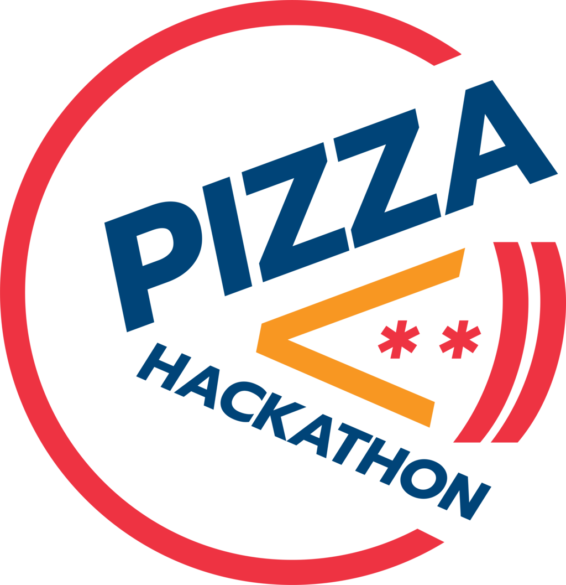

<p align="center"><a href="#" target="_blank" rel="noopener noreferrer"></a></p>

<h2 align="center">Pizza Coin</h2>

## Brief Synopsis of Pizza Hackathon

<a href="https://www.facebook.com/events/205814763443058/">Pizza Hackathon</a> is the 1st blockchain hackathon event in Thailand which would be held on 25-26 August 2018. The objective of this event is to educate blockchain technologies as well as building thai blockchain developers. The event consists of educating and project hacking sessions where all participating developers are freely to develop any project based on blockchain technologies. There would eventually be a project competition among teams of developers at the end of the event. 

To find the winner team, we developed a voting system called the Pizza Coin (PZC). The PZC is a voting system based on <a href="https://www.ethereum.org/">Ethereum</a> blockchain's <a href="https://solidity.readthedocs.io/">smart contract</a> compatible with <a href="https://en.wikipedia.org/wiki/ERC-20">ERC-20 token standard</a>. Each event participant (i.e., all the participating developers and the event staffs) would be registered to the PZC contract. The PZC contract allows a group of developers create and join a team. Any authorized staff is able to perform operations such as kicking some developer from a team, kicking a whole team, changing contract states, etc. All participants would receive equal voting tokens. With the PZC contract, a participating developer is able to give votes to his/her favourite projects developed by other different teams whereas a staff has freedom to vote to any teams. Each voter can spend voting tokens according to his/her own balance. Specifically, all the voting results would be transacted and recorded on the blockchain. As a result, the winner team who gets a maximum voting tokens would be judged transparently by the developed PZC contract without any possible interference even by any event staff.

## Workflow Design of Pizza Coin Contract

One of the biggest challenges when developing an Ethereum smart contract is the way to handle 'Out-of-Gas' error while deploying the contract to the blockchain network, due to the block gas limit on Ethereum blockchain. The prototype of our PZC contract also confronted with this limitation since our contract requires several functional subsystems such as staff management, team and player management and voting management subsystems. To avoid the block gas limit problem, we decided to develop the PZC contract using the contract factory method (we will describe the brief details later).

The PZC contract consists of eight dependencies including Staff contract, Player contract, Team contract, Staff Deployer library, Player Deployer library, Team Deployer library, CodeLib library and CodeLib2 library.

The PZC contract acts as the mother contract of all dependencies. the PZC has three children contracts, namely Staff, Player and Team contracts which would be deployed by the libraries named Staff Deployer, Player Deployer and Team Deployer respectively. Furthermore, the PZC also has another two libraries named CodeLib and CodeLib2 which would be used as the external source code libraries for the PZC mother contract itself.

<br /><p align="center"></p>
<h3 align="center">Figure 1. Deployment of Pizza Coin contract</h3><br />

There were two stages when deploying the PZC contract to the blockchain. In the first stage, the PZC contract's dependencies including Staff Deployer, Player Deployer, Team Deployer, CodeLib and CodeLib2 libraries had to be deployed to the blockchain as seperate transactions. The previously deployed libraries' addresses would then be linked and injected as dependency instances in order to deploy the PZC mother contract to Ethereum network as shown in Figure 1. 
    
<br /><p align="center"></p>
<h3 align="center">Figure 2. Initialization of Pizza Coin contract</h3><br />

In the second stage, the deployed PZC mother contract had to be initialized by creating its children contracts--including Staff, Player and Team contracts--as shown in Figure 2. At this point, we employed the contract factory method using the contract deployer libraries, i.e. Staff Deployer, Player Deployer and Team Deployer, to deploy each corresponding child contract. The resulting children contracts' addresses would then be returned to store on the PZC contract. This way make the PZC contract know where its children contracts were located.

<br /><p align="center"></p>
<h3 align="center">Figure 3. Pizza Coin contract acts as a contract coordinator for Staff, Player and Team contracts</h3><br />

The PZC contract would be considered as a contract coordinator or a reverse proxy contract for Staff, Player and Team contracts. When a user needs to interact with any contract function, he/she just makes a call to the PZC contract right away. For example, a user wants to join some specific team, he/she can achieve this by invoking the registerPlayer() function of the PZC contract. The PZC contract would then interact with its children contracts in order to do register the calling user as a player to the specified team.

On the prototype of our PZC contract, we faced 'Out-of-Gas' error when deploying the contract because the contract contains too many functions. The solution to avoiding such the error we have used on a production version is to migrate almost all the logical source code of each function in the PZC contract to store on another external libraries named CodeLib and CodeLib2 instead as shown in Figure 3. 

For example, when a user makes a call to the registerPlayer() function of the PZC contract (let's call PZC.registerPlayer() for short), the PZC.registerPlayer() will forward the request to CodeLib.registerPlayer() in order to process the requesting transaction on behalf of the PZC contract instead. Note that, the CodeLib.registerPlayer() in question is the mapped function of the PZC.registerPlayer() which is stored on the external CodeLib library. Then, the CodeLib.registerPlayer() will hand over the process to the real worker function called Player.registerPlayer(). With this code migration method, we can significantly reduce a gas consumption when deploying the PZC mother contract.

<br />

## Deploy PizzaCoin contract

### To install Truffle Framework
&emsp;<a href="https://truffleframework.com/docs/truffle/getting-started/installation">Follow this link</a>

### To install Node.JS dependency packages
```
npm install
```

### To get Infura API for free
&emsp;<a href="https://infura.io">Register to get a free api.</a> Note that, the api will be sent to your registered e-mail.

### To set up 'infura-api.secret' file
```
echo "'your-infura-api'" > infura-api.secret  // Your Infura api must be marked with single quotes
```

### To set up 'mnemonic.secret' file
```
echo "'your-secret-mnemonic'" > mnemonic.secret  // Your secret mnemonic must be marked with single quotes
```

### To compile PizzaCoin contract and its dependencies
```
truffle compile
```

### To deploy PizzaCoin contract and its dependencies
```
truffle migrate --network mainnet  // Deploy to Ethereum public main network via Infura
```

```
truffle migrate --network ropsten  // Deploy to Ropsten testnet via Infura
```

```
truffle migrate --network rinkeby  // Deploy to Rinkeby testnet via Infura
```

```
truffle migrate --network kovan  // Deploy to Kovan testnet via Infura
```

```
truffle migrate --network rinkeby_localsync  // Deploy to Rinkeby testnet via local Geth node
```

```
truffle migrate --network ganache  // Deploy to Ganache local test environment
```

### To initial PizzaCoin contract (use this when integrating the contract with DApp)
```
node init-contract.js <<ethereum_network>>  // For example, run 'node init-contract.js rinkeby'
```

### To execute Node.JS based lazy-web3-wrapper functions (for demonstrating how to interact the contract with web3 node.js backend)
```
node web3-demo.js  // This script supports a connection to Ganache or local Geth/Parity node only
```

<br />

## List of PizzaCoin contract address and its dependency addresses
The following addresses point to PizzaCoin contract as well as its dependencies that were used in the hackathon event.

- <b>Ethereum network:</b> <a href="https://kovan.etherscan.io/">Kovan</a>
- <b>PizzaCoin contract:</b> <a href="https://kovan.etherscan.io/address/0x76030b8f0e6e938afabe7662ec248f2b7815e6bb">0x76030b8f0e6e938afabe7662ec248f2b7815e6bb</a>
- <b>PizzaCoinStaffDeployer library:</b> <a href="https://kovan.etherscan.io/address/0x7F8366b1C1aCE62A74531F9D1477428E15Aa1109">0x7F8366b1C1aCE62A74531F9D1477428E15Aa1109</a>
- <b>PizzaCoinPlayerDeployer library:</b> <a href="https://kovan.etherscan.io/address/0x2659a5CEcC38250bf8a0F4f48DBF9C36C4eAB923">0x2659a5CEcC38250bf8a0F4f48DBF9C36C4eAB923</a>
- <b>PizzaCoinTeamDeployer library:</b> <a href="https://kovan.etherscan.io/address/0xD32dC427118DA8CBfc300C6E483C03d7877f3d39">0xD32dC427118DA8CBfc300C6E483C03d7877f3d39</a>
- <b>PizzaCoinCodeLib library:</b> <a href="https://kovan.etherscan.io/address/0xD9ea584DAB76F0BcF6Db85D61AA7Ee5606f15876">0xD9ea584DAB76F0BcF6Db85D61AA7Ee5606f15876</a>
- <b>PizzaCoinCodeLib2 library:</b> <a href="https://kovan.etherscan.io/address/0xFaB51C36088D9651872f2cd610dAE7F82E4F04E0">0xFaB51C36088D9651872f2cd610dAE7F82E4F04E0</a>
- <b>PizzaCoinStaff contract:</b> <a href="https://kovan.etherscan.io/address/0xEa1E67465b688Ea1b30856F55AcD77af43376d01">0xEa1E67465b688Ea1b30856F55AcD77af43376d01</a>
- <b>PizzaCoinPlayer contract:</b> <a href="https://kovan.etherscan.io/address/0x785A811Ad43c733B0FdDd8113E8478bc2AEd02e0">0x785A811Ad43c733B0FdDd8113E8478bc2AEd02e0</a>
- <b>PizzaCoinTeam contract:</b> <a href="https://kovan.etherscan.io/address/0x216C611001b2e8B6ff2cf51C5e9EB39ABE558E35">0x216C611001b2e8B6ff2cf51C5e9EB39ABE558E35</a>
